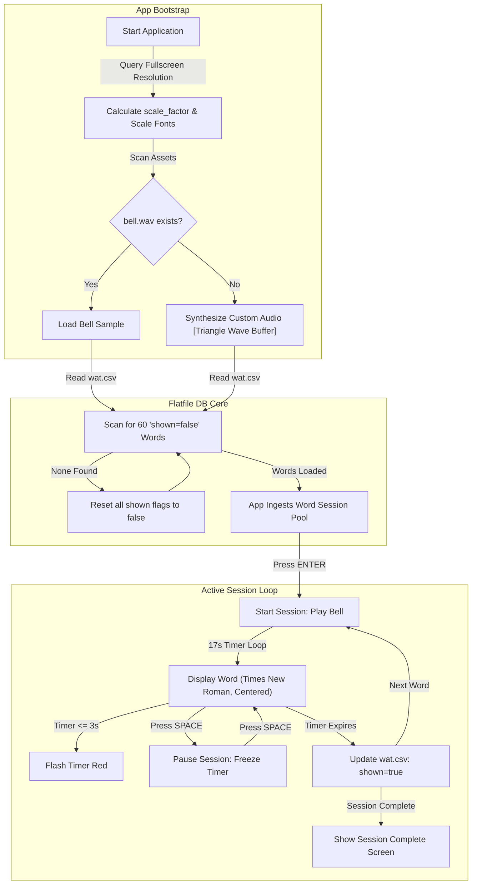

# 👁️ SSB Word Association Test (WAT) Immersive Pygame Simulator

> A distraction-free, high-fidelity fullscreen desktop trainer built with Pygame to prepare candidates for the Services Selection Board (SSB) psychological evaluations.

[](https://opensource.org/licenses/MIT)
[](https://www.python.org/)
[](https://www.pygame.org/)
[](https://docs.python.org/3/library/csv.html)

SSB Word Association Test (WAT) is a premium, immersive desktop utility engineered to **simulate the intense psychological testing conditions** of the Indian Armed Forces selection process. Under pressure, candidates are shown a series of 60 words, each for a brief 15 to 17 seconds, during which they must write down spontaneous, positive sentences. 

This application uses Pygame to create a completely distraction-free, fullscreen visual workspace. It features dynamic screen-resolution typography scaling, persistent state-tracking, and programmatically synthesized audio backups.

---

## 🏛️ Application State & Game Loop



---

## ⚡ Core Technical Pillars

### 1. Aspect-Ratio Sensitive Typography Engine
To maintain high-fidelity layouts across diverse displays (from 1080p notebooks to 4K desktop screens), the application dynamically queries system metrics on startup:
```python
SCALE_FACTOR = min(SCREEN_WIDTH / 1024, SCREEN_HEIGHT / 768)
FONT_SIZE = int(BASE_FONT_SIZE * SCALE_FACTOR)
```
This scale factor dynamically recalculates all text bounding boxes, font heights, and vertical grid offsets, guaranteeing that the central word remains crisp, perfectly aligned, and prominent.

### 2. Programmatic Audio Synthesis Fallback
If the physical `bell.wav` file is absent, the system does not crash or fail silently. It falls back to an **on-the-fly digital signal synthesizer** using Python's audio array buffer:
*   Generates a custom triangle wave frequency array at $22050\text{ Hz}$ sampling rate.
*   Applies a mathematically mapped linear volume envelope fade to emulate the decay profile of a real bell.
*   Injects a custom audio array into `pygame.sndarray.make_sound` to output clear, hardware-independent audio tones.

### 3. Persistent Flat-File State Database
Saves test progress natively using a CSV flat-file (`wat.csv`) acting as a state database:
*   **Progressive Loading:** Every session selectively parses the sheet to extract the next 60 unshown words.
*   **Real-time Saves:** At the exact second a word's timer expires, the script modifies the specific file line in `wat.csv`, toggling `shown` to `true`.
*   **Auto-Recycling:** When the entire word database is exhausted, the app triggers a complete table scan, resetting all flags back to `false` automatically.

### 4. Precision Timer & Pause Stack
Maintains sub-millisecond timer accuracy by tracking physical time deltas via `time.time()` rather than relying on frame-rate-dependent ticks, ensuring consistent pacing even during frame drops. When a candidate pauses the test, the active remaining delta is safely pushed onto the heap, then restored when resuming.

---

## 🕹️ Controls & Navigation

*   <kbd>ENTER</kbd> : Start/Resume a test session from the menu screens.
*   <kbd>SPACEBAR</kbd> : Toggle pause/resume during an active test to inspect sentences.
*   <kbd>ESCAPE</kbd> : Instantly exit the fullscreen application.

---

## 🚀 Quick Start (Under 10 Seconds)

### 1. Clone the Repository
```bash
git clone https://github.com/seeramsujay/Word-Association-Test-SSB-.git
cd Word-Association-Test-SSB-
```

### 2. Install Pygame Engine
```bash
pip install pygame
```

### 3. Launch the Simulator
Run the main script to start your training session:
```bash
python wat.py
```

### 4. Customizing the Word Pool
Open `wat.csv` in any spreadsheet or text editor to append your own words:
```csv
word,best_response,shown
RESILIENCE,Resilience helps overcome setbacks,false
STRATEGY,A good strategy ensures success,false
```

---

## 📁 Repository Layout

*   `wat.py`: The core application class containing the Pygame loop, canvas renderer, state updates, and audio synthesizer.
*   `wat.csv`: The active word flat-file database (includes hundreds of pre-seeded words).
*   `wat-chatgpt.csv` / `wat.csv - set3(final).csv`: Expanded and categorized backup sets.

---

## 📄 License

This project is licensed under the **MIT License**. See `LICENSE` for details.
